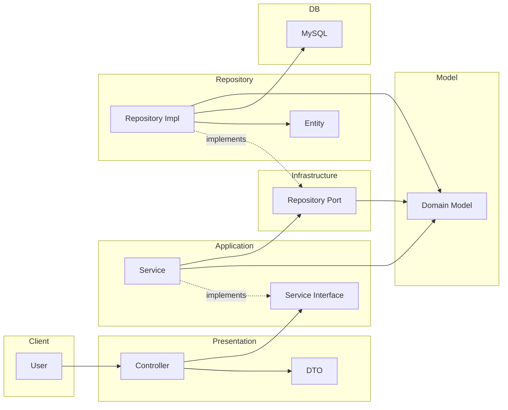

## 아키텍처 개요

```mermaid
flowchart LR
    subgraph Client
        user[User]
    end

    subgraph Presentation
        controller[Controller]
        dto[DTO]
    end

    subgraph Application
        usecase[Service Interface]
        service[Service]
    end

    subgraph Model
        domain[Domain Model]
    end

    subgraph Infrastructure
        port[Repository Port]
    end

    subgraph Repository
        adapter[Repository Impl]
        entity[Entity]
    end

    subgraph DB
        database[MySQL]
    end

    user --> controller

    controller --> dto
    controller --> usecase
    service -. implements .-> usecase
    service --> domain
    service --> port
    adapter -. implements .-> port
    adapter --> entity
    adapter --> database
    adapter --> domain
    port --> domain

```