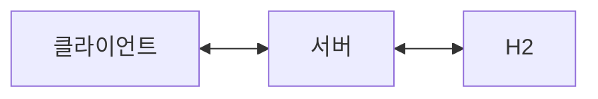
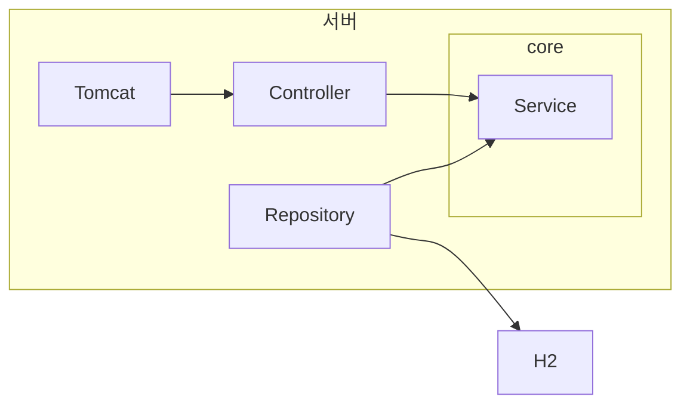

# 설문조사_techspec_v1.md

## 요약
> 설문 조사의 생성, 수정 및 응답에 대한 제출과 결과 조회를 제공하는 서비스를 구현합니다.
---
## 목표
- 특정 분야의 설문 조사 양식을 생성할 수 있습니다.
	- 설문 조사의 이름과 설문 받을 항목을 직접 지정할 수 있습니다.
- 이미 등록된 설문 조사를 수정할 수 있습니다.
	- 설문 조사가 수정되더라도 이전에 수행한 결과는 유지됩니다.
- 설문 조사를 수행한 응답을 제출할 수 있습니다.
- 설문 조사별 응답 결과를 조회할 수 있습니다.
---
## 아키텍쳐
### 시스템 아키텍쳐
- 클라이언트에서 REST API를 이용하여 서버에 요청을 전달합니다.
- 서버는 H2 DB에서 정보를 조회, 수정하고 비즈니스 로직을 수행하여 응답을 생성합니다.
- 서버는 응답을 클라이언트에게 전달합니다.

### 서버 아키텍쳐
- Spring MV의 레이어드 아키텍쳐로 구성합니다.
- 내장 tomcat을 이용하여 클라이언트의 요청을 수신하고 응답을 반환합니다.
- Spring JPA를 이용해서 H2에 DB 쿼리 요청을 전달하고 결과를 객체로 변환합니다.

---
## 기술 스택
### 애플리케이션
- Spring boot 3.5.0
- Spring webmvc 6.2.7
- Spring data JPA 3.5.0
- h2 database 2.3.232
### 개발 환경
- Java 17
- Gradle Project
- MacOS
- IntelliJ IDEA 2023.3.5 (Ultimate Edition)
### 테스트
- JUnit 5.12.2
- Mockito 5.17.0
---
## 데이터 모델링
### ERD
![[ERD_v1.png|500]]