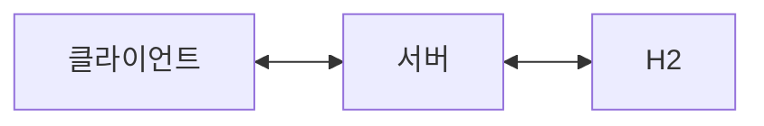
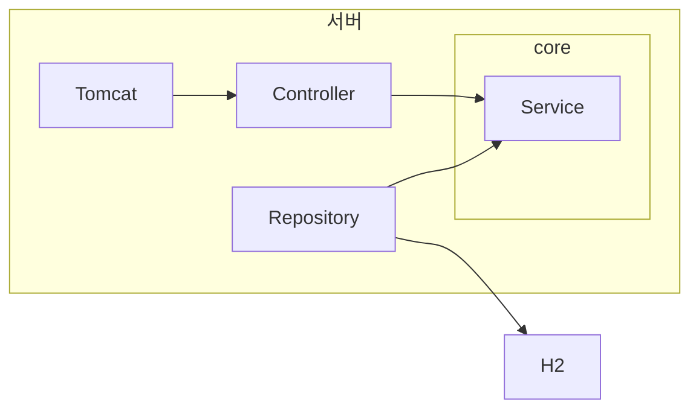

# 설문조사_techspec_v1.md

## 요약

> 설문 조사의 생성, 수정 및 응답에 대한 제출과 결과 조회를 제공하는 서비스를 구현합니다.

---

## 목표

- 특정 분야의 설문 조사 양식을 생성할 수 있습니다.
    - 설문 조사의 이름과 설문 받을 항목을 직접 지정할 수 있습니다.
- 이미 등록된 설문 조사를 수정할 수 있습니다.
    - 설문 조사가 수정되더라도 이전에 수행한 결과는 유지됩니다.
- 설문 조사를 수행한 응답을 제출할 수 있습니다.
- 설문 조사별 응답 결과를 조회할 수 있습니다.

---

## 아키텍쳐

### 시스템 아키텍쳐

- 클라이언트에서 REST API를 이용하여 서버에 요청을 전달합니다.
- 서버는 H2 DB에서 정보를 조회, 수정하고 비즈니스 로직을 수행하여 응답을 생성합니다.
- 서버는 응답을 클라이언트에게 전달합니다.



### 서버 아키텍쳐

- Spring MV의 레이어드 아키텍쳐로 구성합니다.
- 내장 tomcat을 이용하여 클라이언트의 요청을 수신하고 응답을 반환합니다.
- Spring JPA를 이용해서 H2에 DB 쿼리 요청을 전달하고 결과를 객체로 변환합니다.



---

## 기술 스택

### 애플리케이션

- Spring boot 3.5.0
- Spring webmvc 6.2.7
- Spring data JPA 3.5.0
- h2 database 2.3.232

### 개발 환경

- Java 17
- Gradle Project
- MacOS
- IntelliJ IDEA 2023.3.5 (Ultimate Edition)

### 테스트

- JUnit 5.12.2
- Mockito 5.17.0

---

## 데이터 모델링

### ERD

![[ERD_v1.png|500]]

### 스키마

```sql
CREATE TABLE survey
(
    id          binary(16) NOT NULL COMMENT '설문 조사 식별자',
    version     int          NOT NULL DEFAULT 1 COMMENT '설문 조사 버전',
    title       varchar(200) NOT NULL COMMENT '설문 조사 제목',
    description varchar(1000) NULL COMMENT '설명',
    created_at  timestamp    NOT NULL COMMENT '생성일시',
    updated_at  timestamp    NOT NULL COMMENT '수정일시',
    PRIMARY KEY (id, version)
) COMMENT '설문 조사 테이블';

CREATE TABLE questions
(
    id             binary(16) NOT NULL COMMENT '질문 식별자',
    survey_id      binary(16) NOT NULL COMMENT '설문 조사 식별자',
    survey_version int          NOT NULL COMMENT '설문 조사 버전',
    name           varchar(200) NOT NULL COMMENT '항목 이름',
    description    varchar(1000) NULL COMMENT '설명',
    input_type     varchar(20)  NOT NULL COMMENT '항목 입력 형태',
    required       boolean      NOT NULL COMMENT '필수 입력 여부',
    sort_order     int          NOT NULL COMMENT '질문 정렬 순서',
    created_at     timestamp    NOT NULL COMMENT '생성일시',
    updated_at     timestamp    NOT NULL COMMENT '수정일시',
    PRIMARY KEY (id),
    FOREIGN KEY (survey_id, survey_version) REFERENCES survey (id, version)
) COMMENT '질문 테이블';

CREATE TABLE options
(
    option_id   binary(16) NOT NULL COMMENT '후보 식별자',
    question_id binary(16) NOT NULL COMMENT '항목 식별자',
    text        varchar(1000) NOT NULL COMMENT '후보 값',
    sort_order  int           NOT NULL COMMENT '정렬 순서',
    created_at  timestamp     NOT NULL COMMENT '생성일시',
    updated_at  timestamp     NOT NULL COMMENT '수정일시',
    PRIMARY KEY (option_id),
    FOREIGN KEY (question_id) REFERENCES questions (id)
) COMMENT '설문 항목 후보 테이블';

CREATE TABLE response
(
    response_id    binary(16) NOT NULL COMMENT '응답 식별자',
    survey_id      binary(16) NOT NULL COMMENT '설문 조사 식별자',
    survey_version int          NOT NULL COMMENT '설문 조사 버전',
    respondent_id  varchar(200) NOT NULL COMMENT '제출자 ID',
    sumitted_at    timestamp    NOT NULL COMMENT '제출일시',
    created_at     timestamp    NOT NULL COMMENT '생성일시',
    PRIMARY KEY (response_id),
    FOREIGN KEY (survey_id, survey_version) REFERENCES survey (id, version)
) COMMENT '설문 조사 응답 테이블';

CREATE TABLE answer
(
    response_id binary(16) NOT NULL COMMENT '응답 식별자',
    question_id binary(16) NOT NULL COMMENT '항목 식별자',
    text_value  varchar(1000) NOT NULL COMMENT '응답 값',
    created_at  timestamp     NOT NULL COMMENT '생성일시',
    FOREIGN KEY (response_id) REFERENCES response (response_id),
    FOREIGN KEY (question_id) REFERENCES questions (id),
) COMMENT '설문 조사 응답 값 테이블';
```

---

## API 명세

### 공통

- 기본 URL : `/api/v1/survey`
- 모든 응답 형식 : `application/json`
- 모든 ID 형식은 UUID를 사용합니다.
- `inputType`은 `SINGLE_SELECT`, `MULTI_SELECT`, `SHORT_TEXT`, `LONG_TEXT` 중 하나입니다.

### 설문 조사 생성

#### 요청

- URL : `/api/v1/survey`
- Method : `POST`
- 설명 : 새로운 설문 조사를 생성합니다.

**body**

```json
{
  "title": "설문 조사 제목",
  "description": "설문 조사 설명",
  "questions": [
    {
      "name": "질문 1",
      "description": "질문 설명",
      "inputType": "SINGLE_SELECT",
      "required": true,
      "sortOrder": 1,
      "options": [
        {
          "text": "선택 옵션 1",
          "sortOrder": 1
        },
        {
          "text": "선택 옵션 2",
          "sortOrder": 2
        }
      ]
    }
  ]
}
```

#### 응답

- 상태 코드 : `201 Created`

```json
{
  "data": {
    "id": "survey-UUID"
  }
}
```

### 설문 조사 수정

#### 요청

- URL : `/api/v1/survey/{id}`
- Method : `PUT`
- 설명 : 기존 설문 조사를 수정합니다.
- `id`는 수정할 설문 조사 ID입니다.
- 수정 시, 설문 조사에 포함된 질문과 옵션을 모두 포함해야 합니다. 기존 질문이나 옵션은 삭제되지 않습니다.

**body**

```json
{
  "title": "수정된 설문 조사 제목",
  "description": "수정된 설문 조사 설명",
  "questions": [
    {
      "id": "질문 ID",
      "name": "수정된 질문 1",
      "description": "수정된 질문 설명",
      "inputType": "MULTI_SELECT",
      "required": false,
      "sortOrder": 1,
      "options": [
        {
          "id": "옵션 ID",
          "text": "수정된 선택 옵션 1",
          "sortOrder": 1
        },
        {
          "id": "옵션 ID",
          "text": "기존 선택 옵션 2",
          "sortOrder": 2
        }
      ]
    }
  ]
}
```

#### 응답

- 상태 코드 : `200 OK`

```json
{
  "data": {
    "id": "survey-UUID"
  }
}
```

### 설문 조사 응답 제출

#### 요청

- URL : `/api/v1/survey/{id}/response`
- Method : `POST`
- 설명 : 설문 조사에 대한 응답을 제출합니다.

**body**

```json
{
  "surveyId": "설문 조사 ID",
  "surveyVersion": 1,
  "respondentId": "응답자 ID",
  "answers": [
    {
      "questionId": "질문 1 ID",
      "textValue": "응답 값 1"
    },
    {
      "questionId": "질문 2 ID",
      "textValue": "응답 값 2"
    }
  ]
}
```

#### 응답

- 상태 코드 : `201 Created`

```json
{
  "data": {
    "responseId": "응답 ID"
  }
}
```

### 설문 조사 응답 결과 조회

#### 요청

- URL : `/api/v1/survey/{id}/response`
- Method : `GET`
- 설명 : 특정 설문 조사에 대한 응답 결과를 조회합니다.
- 쿼리 파라미터에는 질문과 옵션을 포함한 응답 결과를 필터링할 수 있습니다.

**쿼리 파라미터(Optional)**

- `questionId`: 특정 질문 ID로 필터링
- `optionId`: 특정 옵션 ID로 필터링

#### 응답

- 상태 코드 : `200 OK`

```json
{
  "data": [
    {
      "responseId": "응답 ID",
      "respondentId": "응답자 ID",
      "submittedAt": "2023-10-01T12:00:00Z",
      "answers": [
        {
          "questionId": "질문 ID",
          "textValue": "응답 값"
        },
        {
          "questionId": "질문 ID",
          "textValue": "응답 값"
        }
      ]
    }
  ]
}
```

### 예외 처리

#### 공통 응답 형식

```json
{
  "error": {
    "code": "EMPTY_QUESTIONS",
    "message": "오류 메시지"
  }
}
```

#### 예외 코드 목록(코드 : 메시지)

**설문 조사 생성 / 수정**

- 404 NOT FOUND
    - `SURVEY_NOT_FOUND`: "수정할 대상 설문 조사를 찾을 수 없습니다."
- 400 BAD REQUEST
    - `EMPTY_TITLE`: "설문 조사의 제목은 필수입니다."
    - `EMPTY_QUESTIONS`: "설문 조사는 최소 1개의 질문이 필요합니다."
    - `OVER_MAX_QUESTIONS`: "설문 조사는 최대 10개의 질문까지만 허용됩니다."
    - `INVALID_INPUT_TYPE`: "잘못된 입력 형태입니다. SINGLE_SELECT, MULTI_SELECT, SHORT_TEXT, LONG_TEXT 중 하나여야 합니다."
    - `EMPTY_OPTION`: "선택형 질문에는 최소 1개의 옵션이 필요합니다."
    - `OVER_MAX_OPTIONS`: "선택형 질문에 대한 옵션은 최대 10개까지만 허용됩니다."

**설문 조사 응답 제출**

- 404 NOT FOUND
    - `SURVEY_NOT_FOUND`: "해당 설문 조사이 이미 삭제되었거나 존재하지 않습니다."
    - `QUESTION_NOT_FOUND`: "해당 질문이 존재하지 않습니다."
- 400 BAD REQUEST
    - `MISSING_REQUIRED_ANSWER` : "필수 질문에 대한 응답이 누락되었습니다."
    - `INVALID_QUESTION_TYPE` : "일치하지 않는 질문이 존재합니다."
    - `INVALID_OPTION` : "선택형 질문에 대한 잘못된 옵션이 포함되어 있습니다."

**설문 조사 응답 결과 조회**
- 404 NOT FOUND
    - `SURVAY_NOT_FOUND`: "해당 설문 조사가 존재하지 않습니다."